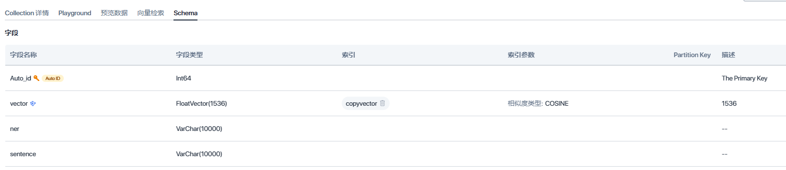

# LTNER
Large Language Model Tagging for Named Entity Recognition with Contextualized Entity Marking

## quick start
### 0. create a python env
use windows and install anaconda,crate a env for LTNER
```bash
conda create -n ltner python==3.10
conda activate ltner
pip install -r requirement.txt
```
and put your openai key to common/chatgpt/gpt.py:21
### 1. create a vector database
you can use milves or cloud service such as zilliz:https://cloud.zilliz.com.cn/

create a index include these fields


put your database service url and token to common/vector/zilliz.py:8

### 2. embedding data and send to database
run data\sentence_emb\emb.py
run data\sentence_emb\emb_TEST.py

### 3. run LTNER
run main.py

